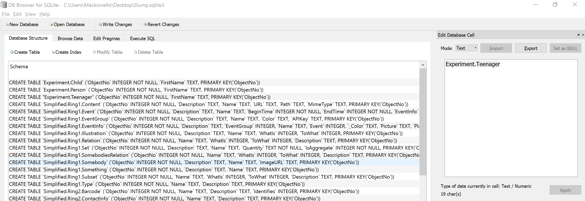
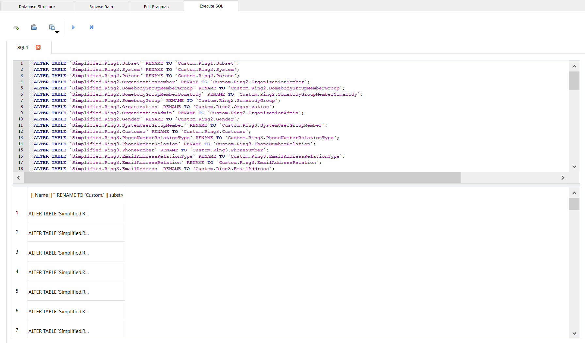
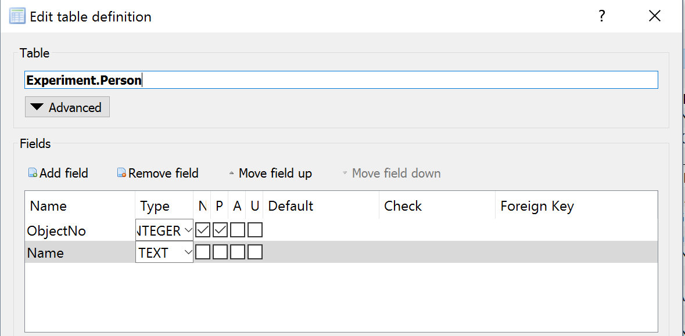

# Using Unload/Reload to Modify Database Schema

When making changes to the database schema of an application, the change has to be made in the database and in the application. This is accomplished by following these steps:

1. Unload the database using StarDump to SQLite
2. Modify the schema in the database using DB Browser for SQLite
3. Modify the schema in the application
4. Reload the database from SQLite to Starcounter using StarDump

Before starting this process, make sure that there is a backup of the database in case anything goes awry. Information on how to do that can be found in [Run Starcounter in Production](run-starcounter-in-production.md).

## Unload the Database

To unload the database, the [StarDump](https://github.com/Starcounter/StarDump) tool is used. From Starcounter `2.3.0.5427` and `2.4.0.369` it can found at `C:\Program Files\Starcounter\stardump`.

From the stardump directory, use the `stardump unload` command to unload the database. For example, to unload the `default` database to the Desktop, the following would be used:

```text
stardump unload --database default --file C:\Users\[User]\Desktop\Dump
```

This creates the file `Dump.sqlite3` on the desktop.

## Modify the Schema in the Database

In order to open the `sqlite3` file, it is recommended to use [DB Browser for SQLite](http://sqlitebrowser.org/). Using this tool, the schema of the database can be modified. The following examples displays the methods to do almost any schema modification:

### Renaming One Table

If we have the following database schema where we want to change "Teenager" to "Teen":

```csharp
[Database]
public class Person
{
    public string FirstName { get; set; }
}

public class Teenager : Person { }
public class Child : Teenager { }
```

Then, the needed modification is rather limited. In the DB Browser, after unloading the database, the screen should look something like this:



The classes from the application, `Person`, `Teenager` and `Child`, are at the top followed by the `Simplified` tables. The `Simplified` tables can in most cases be disregarded.

Renaming `Teenager` to `Teen` requires two changes, renaming the table itself, and modifying the metadata accordingly. To rename the table itself, right click on the table in the view above and choose `Modify table...`. Then, simply change `[ApplicationName].Teenager` to `[ApplicationName].Teen`. To make this change in the metadata, go to the tab `Browse Data` and find the table `Starcounter.Metadata.Table`. There, click on `[ApplicationName].Teenager` and rename it to `[ApplicationName].Teen`.

### Renaming Multiple Tables

Renaming multiple tables by going through them one by one is not an efficient strategy if there are many tables to rename. To solve this, an SQL query can be used to generate SQL that makes the changes at once. For example, if the goal is to rename all the `Simplified` tables to go by the name of `Custom`, the following SQL query can be used:

```sql
SELECT 'ALTER TABLE `' || Name || '` RENAME TO `Custom.' || substr(Name, 12) || '`;'
FROM `Starcounter.Metadata.Table`
WHERE Name LIKE 'Simplified.%';
```

This will generate as many SQL queries as there are tables to rename. Copy these generated queries, remove the quotation marks in a text editor, paste them back into the query field in the DB Browser, and run them. It should look something like this:



The tables themselves are now renamed. Lastly, run this query to update the metadata accordingly:

```sql
UPDATE `Starcounter.Metadata.Table`
SET Name = 'Custom.' || substr(Name, 12)
WHERE Name LIKE 'Simplified.%';
```

### Renaming Columns

Renaming columns is relatively easy in DB Browser. Consider the case where the goal is to rename the column `FirstName` to `Name` in the following model:

```csharp
[Database]
public class Person
{
    public string FirstName { get; set; }
}

public class Teenager : Person { }
public class Child : Teenager { }
```

Similar to how tables are renamed, it needs to be renamed in two places: in the table properties and in the metadata.

To rename the column of a specific table, simply right-click on it, in this case `Person` and choose `Modify Table...`. Double click on the field `FirstName` and enter `Name`. Repeat this step for all the tables that inherits this column, in this example, they are `Teenager` and `Child`.



Rename the column in the metadata at `Starcounter.Metadata.Column` by finding the columns `FirstName` and rename them to `Name`. If it is not completetly clear which columns that should be renamed, use the TableId to find the right columns.


### Modify the Database Schema in the Application

To modify the database schema in the application, simply change it according to the modification done in the database. For example, if the `Teenager` table was renamed to `Teen`, the code would be changed from this:

```csharp
[Database]
public class Person
{
    public string FirstName { get; set; }
}

public class Teenager : Person { }
public class Child : Teenager { }
```

To this:

```csharp
[Database]
public class Person
{
    public string FirstName { get; set; }
}

public class Teen : Person { }
public class Child : Teen { }
```

No matter what change is made, this step is rather trivial. It might even be clever to do this change before modifying the database to get a better overview of the changes.

## Reload the Database

To reload the database, use the `stardump reload` command. For example, to reload the `sqlite3` file "Dump" into the default database, the following would be used:

```text
stardump reload --database default --file C:\Users\[User]\Desktop\Dump.sqlite3
```

If the default database already contains data, it is neccessary to delete it and create a new default database first. That is done using the following two commands:

```text
staradmin -d=default delete --force db
staradmin -d=default new db DefaultUserHttpPort=8080
```

